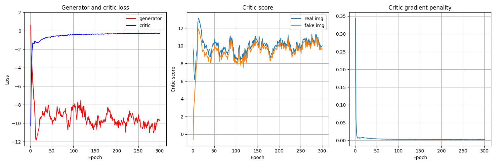
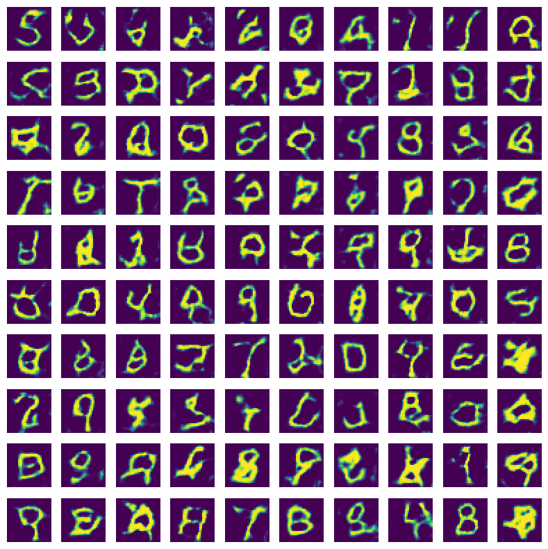

# WGAN: Wasserstein GAN
The Wasserstein GAN was implemented based on a linear activation in the discriminator (now called critic!) and a gradient penality.
This penality term enforces the critic to be Lipschitz-continuous.

## Evaluation

### Loss

### Generated images while training
The WGAN was trained for 300 epochs:
Each column represents a noise vector which is transformed by the generator into an image.
There are ten different noise vectors.
The i^th row represents the model's state at epoch i * 10.

### Generated images
Let's generate 100 images after training the GAN i.e. after 300 epochs.

